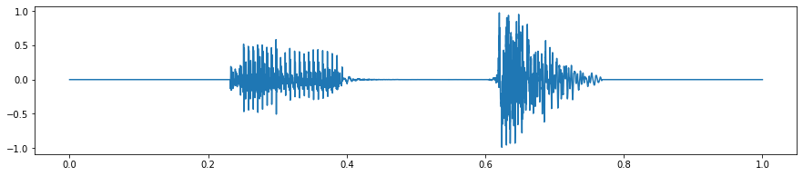

# Speech-Classification
1. Speech data analysis.ipynb preprocessing the dataset from the "data" directory 
   Warning this takes a while since it loads the entire dataset and compresses it to data.pkl, labels.pkl

2.Neural Network Training.ipynb used to train the neural network saves weights as model.h5

3.IVAD.ipynb convert and preprocess personal dataset from ./own directory to ./owntest dir

4.Mytest.ipynb uses the neural net to train on the personal dataset

Note: data directory and pkl files are too large
Datset Name: Speech Commands Data Set v0.02
Download Link used: http://download.tensorflow.org/data/speech_commands_v0.02.tar.gz

Run Files in order lsited above to follow the same process as the project
### Examples of the word UP found in the data

### Final Accuracies of the model

